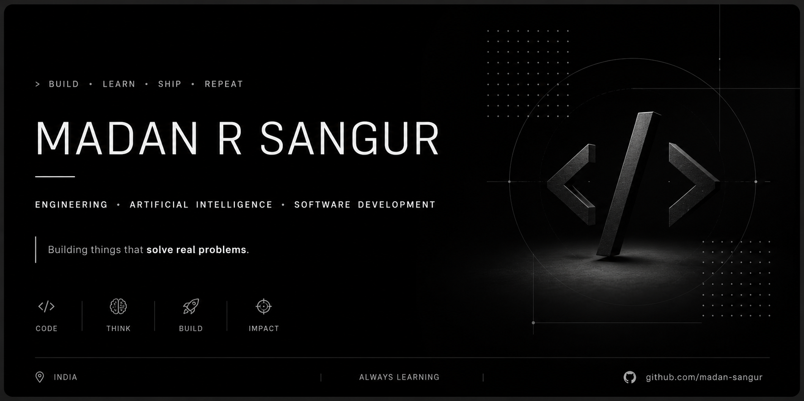

---

## About

- B.Tech in Artificial Intelligence & Machine Learning
- Interested in AI, software engineering, and automation
- Learning by building projects from scratch
- Currently exploring full-stack development and AI systems

---

## Tech Stack

- Python
- Java
- C
- HTML
- CSS
- JavaScript
- Git & GitHub

---

## Current Focus

- Building better software
- Improving engineering skills
- Open Source
- Machine Learning

---

## Featured Projects

- ArcLife

---

> "Consistency compounds."
